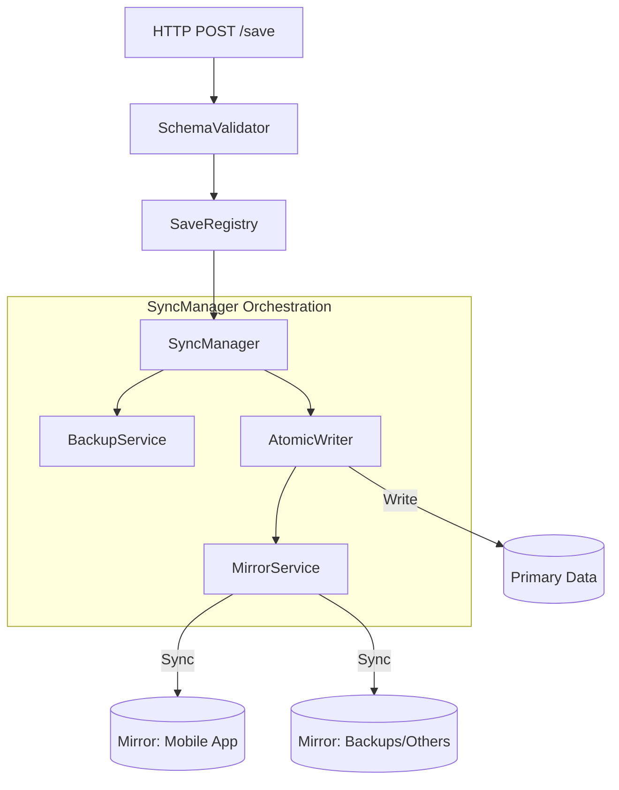

# ZazaLingo Data_Base - Mimari Dökümantasyonu (v10.0 - Sealed)

Bu döküman, ZazaLingo ekosisteminin veri yönetim merkezi olan **Data_Base** backend servisinin teknik mimarisini, veri güvenliği protokollerini ve senkronizasyon mantığını detaylandırmaktadır.

---

## 1. Genel Bakış (Overview)
Data_Base, ZazaLingo uygulaması (Mobile/Web) ve Geliştirici Uygulaması (DevApp) arasında köprü görevi gören, verilerin kalıcı olarak saklandığı ve merkezi olarak yönetildiği bir Node.js servisidir.

---

## 2. Teknoloji Yığını (Tech Stack)
- **Runtime:** Node.js
- **Network:** Native `http` modülü (Hafif ve hızlı)
- **File System:** `fs` & `path` (Doğrudan disk erişimi)
- **Security:** X-API-KEY Authentication & Schema Validation
- **Patterns:** Facade, Registry, Adapter, Service-Oriented Architecture (SOA)

---

## 3. Çekirdek Mimari Kavramları

### 3.1 Hybrid SSoT (Single Source of Truth)
ZazaLingo, verinin hem backend'de (`Data_Base/data`) hem de mobil uygulama dizininde (`ZazaLingo/data`) bulunduğu hibrit bir yapı kullanır.
- **Primary (SSoT):** `Data_Base/data` klasörü mutlak doğrudur. Tüm yazma işlemleri önce buraya yapılır.
- **Mirror (Target):** `ZazaLingo/data` klasörü, uygulamanın çalışması için gerekli olan anlık kopyadır.
- **Orchestration:** `SyncManager`, Primary'deki değişiklikleri otomatik olarak Mirror hedeflere klonlar.

### 3.2 Registry Pattern (OCP Compliance)
Veri kaydetme işlemleri artık devasa bir `switch/case` bloğu yerine `SaveRegistry` üzerinden yönetilir.
- Her veri türü (istasyonlar, testler, temalar) kendi handler'ına sahiptir.
- Yeni bir veri türü eklemek için `database-server.js` kodunu değiştirmek gerekmez; sadece yeni bir handler register edilir.

### 3.3 Partial Success (HTTP 207) Mechanism
Sistem, senkronizasyon durumunu şeffaf bir şekilde raporlar:
- **HTTP 200 (OK):** Veri Primary'ye başarıyla yazıldı ve TÜM Mirror'lara senkronize edildi.
- **HTTP 207 (Multi-Status):** Veri Primary'ye başarıyla yazıldı ANCAK bir veya daha fazla Mirror'a yazılırken hata oluştu.
- **HTTP 400/500:** Kritik bir hata oluştu ve veri Primary'ye bile yazılamadı.

---

## 4. Servis Haritası (Service Map)

| Servis | Sorumluluk |
| :--- | :--- |
| **SyncManager** | **Facade:** Tüm veri akışını orkestre eder. Backups, Atomic Writes ve Mirror Sync işlemlerini tetikler. |
| **AtomicWriter** | **Security:** Veriyi önce `.tmp` dosyasına yazar, başarılıysa yer değiştirir. Retry logic ile Windows dosya kilitlerini aşar. |
| **MirrorService** | **Sync:** Primary dosyasını kayıtlı tüm ayna dizinlere kopyalar ve Primary'de silinen dosyaları Mirror'lardan temizler (Pruning). |
| **SchemaValidator** | **Integrity:** Gelen verilerin PascalCase kurallarına ve hiyerarşik zorunluluklara (örn: topic'ler için `parentUnitId`) uygunluğunu denetler. |
| **BackupService** | **Safety:** Her yazma işleminden önce dosyanın zaman damgalı bir kopyasını `backups/` klasörüne alır. |

### 4.1 Servis İlişki Diyagramı

---

## 5. Veri Yazma Akış Şeması (Write Flow)
1.  **Request:** DevApp bir `POST /save` isteği gönderir.
2.  **Validate:** `SchemaValidator` veriyi yapısal ve semantik olarak kontrol eder.
3.  **Registry:** `SaveRegistry`, ilgili handler'ı (örn: `StationHandler`) bulur ve çalıştırır.
4.  **Backup:** `BackupService` orijinal dosyanın yedeğini alır.
5.  **Atomic Write:** `AtomicWriter` veriyi Primary depoya güvenli bir şekilde yazar.
6.  **Mirror Sync:** `MirrorService` güncellenen dosyayı Mobil Uygulama dizinine klonlar.
7.  **Response:** İşlem sonucuna göre `200` veya `207` koduyla rapor döner.

---

## 6. Güvenlik ve Bütünlük
- **Atomic Renaming:** Dosya yazma işlemi sırasında sistem çökse bile dosya asla bozulmaz (yarım yazılma olmaz).
- **Domain Isolation:** Her servis sadece kendi sorumluluk alanındaki (`AtomicWriter`, `MirrorService` vb.) işleri yapar.
- **Path Guard:** Tüm dosya erişimleri merkezi bir `FileSystemAdapter` üzerinden yapılarak güvenlik denetimi sağlanır.

---
> **Not:** Bu mimari, ZazaLingo v10.0 "Sealing" fazında SOLID prensiplerine tam uyum için refaktör edilmiştir.
